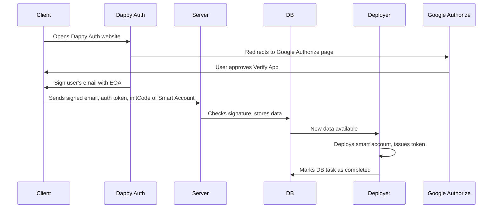

# DappyKit Verify

```mermaid
sequenceDiagram
    participant Client as Client
    participant DappyAuth as Dappy Auth
    participant Server as Server
    participant DB as DB
    participant Deployer as Deployer
    participant GoogleAuth as Google Authorize

    Client->>DappyAuth: Opens Dappy Auth website
    DappyAuth->>GoogleAuth: Redirects to Google Authorize page
    GoogleAuth->>Client: User approves Verify App
    DappyAuth->>Client: Sign user's email with EOA
    Client->>Server: Sends signed email, auth token, initCode of Smart Account
    Server->>DB: Checks signature, stores data
    DB->>Deployer: New data available
    Deployer->>Deployer: Deploys smart account, issues token
    Deployer->>DB: Marks DB task as completed

```
