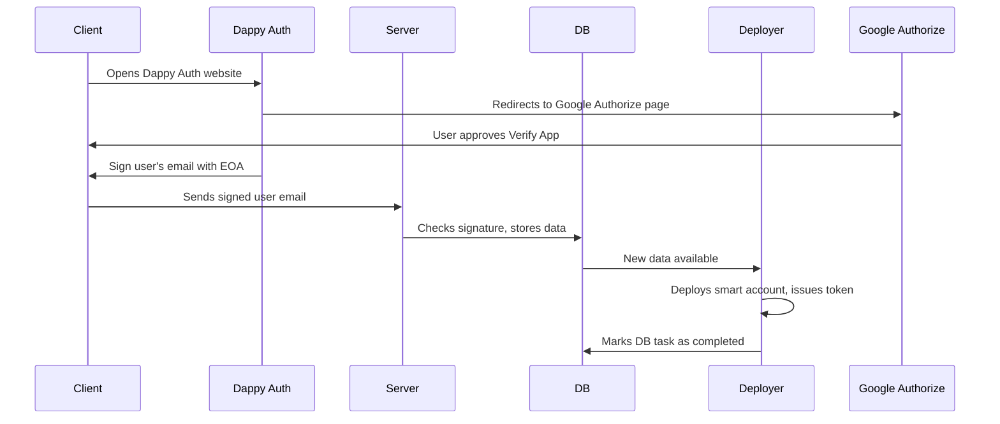

# DappyKit - Deploy and Verify

Smart Account Deployment and Verification Service.

The service performs OAuth and other authentication methods verification. Based on the verified data, an on-chain [Soulbound](https://github.com/DappyKit/contracts/blob/master/contracts/UserVerification.sol) token is issued at the expense of the service, confirming the verification of a person's Smart Account. In addition to verification, the service deploys the Smart Account at its own expense for verified accounts.

## How does it work?

The main goal of this service is to verify and deploy a person's Smart Account with just one request.

A person has an EOA (Externally Owned Account) and their account, for example, in Google. Having an account on an external service signifies that the service has conducted basic verification on the person. At least, one person cannot simply and cheaply create millions of accounts, unlike with EOA.

When a person authenticates with an external service, they additionally sign the service's response using their EOA. The signed response from the service is verified using utilities provided by the service. This way, we can be sure that the person indeed owns the EOA and the external account.

Based on the EOA's signature, the service extracts the ETH address and calculates the Smart Account address. Thanks to account factories, the account deployment happens at a deterministic address, and the owner of such an account will be the EOA owner, not the account that performed the deployment. When using a test network, the deployment of the smart account is carried out using Simple Account Factory.

After the account deployment, we also issue a Soulbound token to the Smart Account address for 6 months. Subsequently, these tokens can be extended, revoked, or reissued to another EOA.

Thus, DappyKit projects and any external projects can verify that a person has performed verification through our service.
The token ID is the person's ID in the external service, hashed using keccak256. In the case of Google, the ID is an internal identifier, not an Email. In the event of a brute force attack on the registry identifier, a hacker would not be able to obtain the Email database, at most - a database of identifiers.
Email and other sensitive data are not stored on our servers.



## Start the server

```shell
# install dependencies
npm ci

# copy and fill the env
cp example.env .env

# create DB
mysql -u root -p < ./migrations/db.sql

# start interactive mode for MySQL user creation:
mysql -u root -p

# and run commands
CREATE USER 'dappy_verify_deploy'@'localhost' IDENTIFIED BY 'STRONG_PASSWORD_HERE';
GRANT ALL PRIVILEGES ON dappy_verify_deploy.* TO 'dappy_verify_deploy'@'localhost';
FLUSH PRIVILEGES;

# apply migrations
npx knex migrate:latest --env production

# start deployer service via PM2
npx pm2 start npm --name "DappyKit Deployer" -- run start-deployer

# OR start the server manually
npm run start
```

## Development

```shell
# create new migration
npx knex migrate:make my_new_migration
```

## Start Demo UI

```shell
# go to "Start the server" section and start the server
# go to web directory
cd demo/web

# install dependencies
npm ci

# start the UI
npm run start
```
